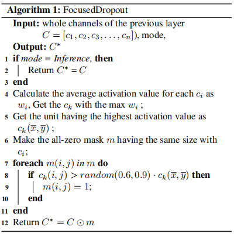
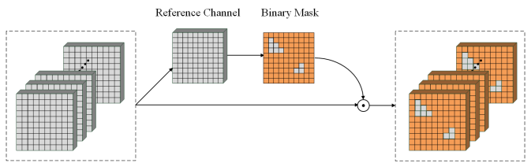

# Focused Dropout
{: .fs-9 }

FocusedDropout is a highly targeted approach that makes the network focus on the most important features (based on the idea of Network Dissection) while dropping 
other features. The methodology for FocusedDropout is shown as Figure 1. To get a visual understanding of FocusedDropout, Figure 2 shows the process of creating the 
binary mask that will be applied to every channel based on the highest activation channel. For this paper, we will be using ResNet-18 for the CNN and CIFAR-10 for 
the dataset.

