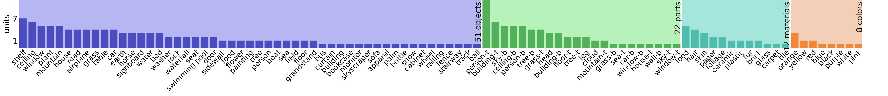
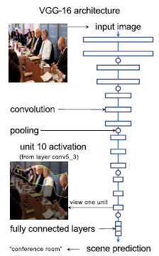
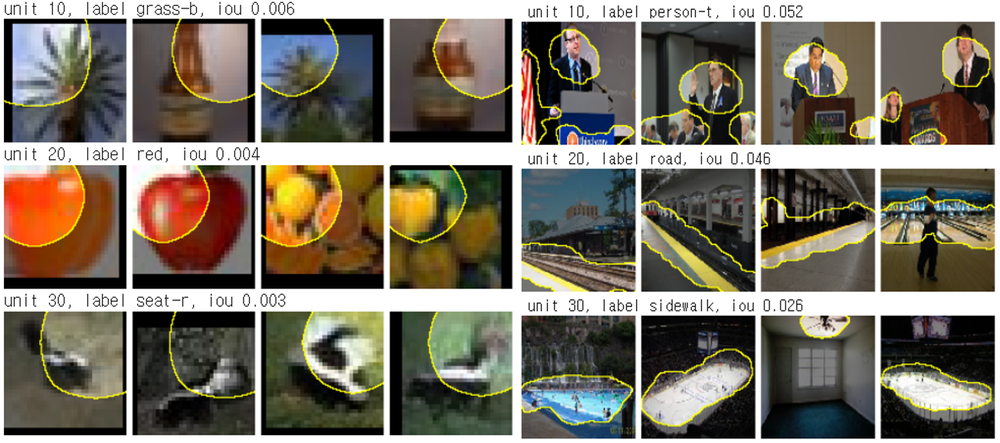

# Network Dissection
{: .no_toc }

The process of network dissection can determine what visual concept in the real world a unit most strongly represents despite not explicitly teaching the model this concept in the training data. The validity of network dissection can be tested by activating or deactivating units based on our new understanding of the encoded representation to determine the importance of the unit to the model performance in specific tasks. By understanding the role of hidden units, we would have a better understanding of network structure, enable interaction between humans and models, and understand how adversarial attacks work.

There are a few previous approaches to solve the problem: salience map, simplified surrogate model, and training explanation network. The salience map approach presents the position of an input image that the network would look at making a decision. Although this helps clarify how a neural network decides on a prediction through a simulation of human sight, this approach lacks an explanation of the weights within the model. An explanation like this tends to be more general rather than our desired approach of understanding individual units and how they work together. The simplified surrogate model is used to simplify the complex behavior of neural networks and training explanation networks generate explanations that can be interpreted by humans. However, these two approaches have huge flaws as they not only fail to directly explain the internal computation of a neural network, but also require training an entire auxiliary model. The commitment of time and resources for these approaches may not be practical for the understanding we wish to achieve. We present a network dissection algorithm which explores the neural network more in depth. Network dissection provides direct examination of the unit weights and is effective without the need to train an auxiliary model. This would allow for greater focus in analysis as a human interface for controlling the network and even gain insight about the black box internals of neural networks.

A strength of network dissection is that the key idea relates to
analyzing the visual concept associated with units within the network,
which is a concept that image-based neural networks employ. Thus,
network dissection can be applied to a wide range of models rather than
specific model architectures for which the algorithm is particularly
designed. While this does restrict network dissection to image-based
tasks, the versatility of network dissection streamlines the
understanding of this type of model significantly. In addition, network
dissection can be applied to multiple tasks as long as the units learn
relations to visual concepts. This is exemplified within this paper as
network dissection is applied to image classification. The variety of
tasks and model architectures that network dissection applies to without
the need for heavy customization makes it a powerful tool to analyze the
role of individual hidden units and find insights about the black box
natures of neural networks.

The first step in training a network on a scene classification task is
to identify units that are capable of detecting objects. In this paper,
we use the Places365 dataset from the Massachusetts Institute of
Technology Computer Science and Artificial Intelligence Laboratory Scene
Recognition Database \[4\] to train a convolutional neural network (CNN)
using the VGG-16 architecture to classify images into 365 scene
categories. Since the last convolution layer has the most
object-detecting units \[1\], we mainly focus on conv5_3 layer.

The units compute activation functions $a_u(x, p)$ that output a signal
at every position p of the image given a test image x. Bilinear
upsampling facilitates the visualization and analysis of filters with
low-resolution outputs. Denote by $t_u$ the top 1% quantile level for
$a_u$: That is, writing $\mathbb{P}_{x_p}[\cdot]$ to indicate the
probability that an event is true when sampled over all positions and
images, we define the threshold
$$t_u \equiv \mathbb{P}_{x_p}[a_u(x , p) > t] \geq 0.01$$. Activation
regions above the threshold are highlighted in visualizations by
$\{p | a_u(x, p) > t_u\}$. Fig.2 shows how this region corresponds to
semantics, for example, the heads of everyone in the picture. We use a
computer vision segmentation model \[5\] that predicts the presence of
the visual concept c within image x at position p based on the agreement
between each filter and the visual concept c.
$s_c : (x, p) \rightarrow \{0, 1\}$; is trained to identify filters that
match semantic concepts. Using the intersection over union (IoU) ratio,
we quantify the agreement between concept c and unit u:

$\begin{aligned} 
IoU_{u,c} = \frac{\mathbb{P}_{x,p}[s_c(x,p)\wedge(a_u(x,p)>t_u)]}{\mathbb{P}_{x,p}[s_c(x,p)\vee(a_u(x,p)>t_u)]}
\end{aligned}$

This IoU ratio is computed on the set of held-out validation set images.
Within this validation set, each unit is scored against 1,825 segmented
concepts c, including object classes, parts of objects, materials, and
colors. Then, each unit is labeled with the highest-scoring matching
concept. Fig.3 shows several labeled concept detector units and the five
images with the highest unit activations.

Within layer conv 3, we find 512 units matching 51 object classes, 22
parts, 12 materials, and eight colors. In some cases, more than one unit
matches the same visual concept. Fig.1 shows the frequency of units
matching segmented concepts with unit types in layer conv5_3, excluding
units with IoU ratios of 4 or 4%. A total of 28 object classes, 25
parts, nine materials, and eight colors can be detected by units at the
last convolutional layer, while the total number of object parts peaks
two layers earlier, at layer conv5_1, where units match 28 object
classes, 25 parts, and nine materials.

## Segment Concepts in Conv5_3 Layer

## Semantic Regions

## Labeled Concept Detector Units on Cifar-100(Left) and Places365(Right)

